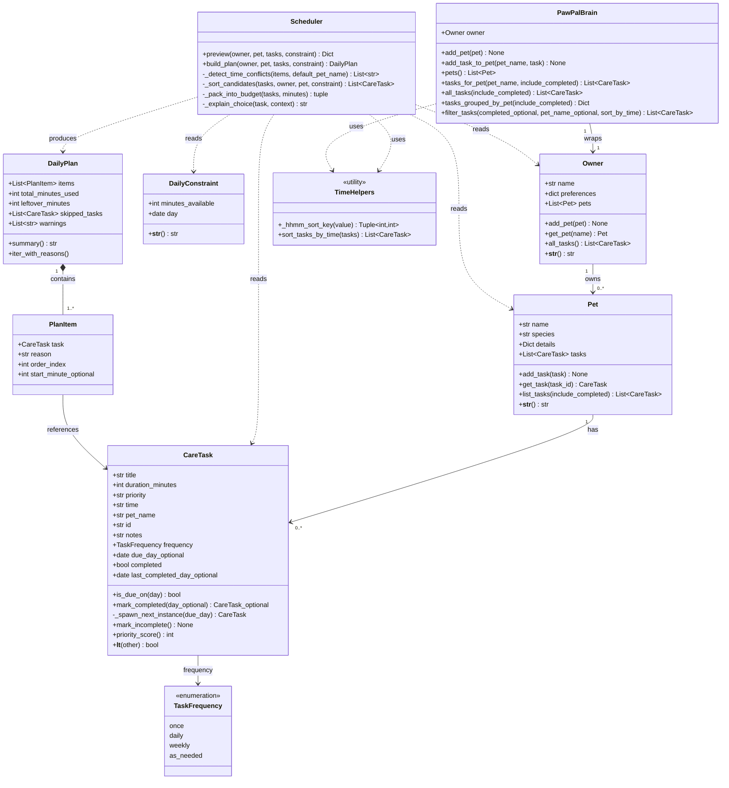

# PawPal+ — Class diagram (Mermaid)

Updated to reflect the current implementation in `pawpal_system.py` (recurrence via `TaskFrequency` + `due_day`, task time sorting, multi-pet brain utilities, and lightweight conflict warnings in `DailyPlan.warnings`).

