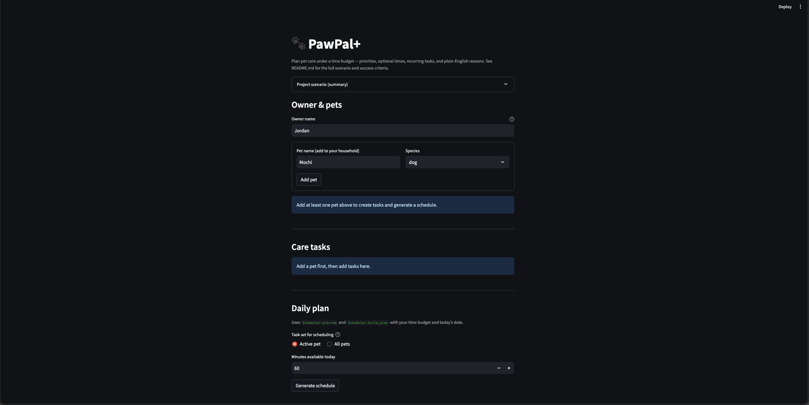

# PawPal+

**PawPal+** is a Streamlit app for planning daily pet-care tasks under a **time budget**, using **priorities**, optional **start times**, and **recurring** tasks. It produces a daily plan and explains why tasks were included or skipped.

## Demo



## Features (what’s implemented)

### Task & household management

- **Owner + multiple pets**: `Owner` stores `pets`; each `Pet` stores its own tasks.
- **Add tasks with scheduling inputs**: title, duration (minutes), priority (low/medium/high), optional start time (`HH:MM`), frequency (once/daily/weekly/as_needed), optional notes.
- **Done today tracking**: marking “Done today” records `last_completed_day` and prevents tasks completed *today* from being scheduled again today.

### Smarter scheduling algorithms

The scheduling logic lives in `pawpal_system.py` (pure Python; no Streamlit imports).

- **Candidate filtering (due-ness)**: `CareTask.is_due_on(day)` determines if a task is eligible on a given day.
  - Tasks with a future `due_day` are excluded until that day.
  - Tasks completed **today** are excluded today (tasks completed on earlier days may appear again—this is current behavior and is covered by tests).
- **Ordering before packing**: candidates are sorted by:
  - priority (high → low),
  - then shorter duration first,
  - then title (alphabetical).
- **Greedy packing into a time budget**: tasks are selected in sorted order until the daily minutes budget is exhausted; remaining due tasks are skipped.
- **Explainable outputs**: scheduled tasks include plain-English reasons; skipped tasks also record skip reasons.
- **Lightweight time conflict warnings**: if 2+ scheduled tasks share the same valid `HH:MM` start time, the plan emits **non-fatal warnings** (invalid times are ignored).

### Recurring tasks (daily/weekly)

- Marking a task as completed will **spawn the next instance** for `daily` (+1 day) and `weekly` (+7 days) frequencies by creating a new `CareTask` with an updated `due_day`.
- The Streamlit UI also supports undo: if you uncheck “Done today”, it removes the auto-spawned next instance when possible.

## How to run the app (visual UI)

### Setup

```bash
python -m venv .venv
source .venv/bin/activate  # Windows: .venv\Scripts\activate
pip install -r requirements.txt
```

### Start Streamlit

```bash
streamlit run app.py
```

Streamlit will print a local URL (typically `http://localhost:8501`).

## Testing PawPal+

Run the automated tests:

```bash
pytest -q
```

The test suite (`tests/test_pawpal_system.py`) validates core domain + scheduling behaviors:

- task creation/validation (owner/pet/task constraints)
- completion tracking (“completed today” filtering)
- due-day gating (`is_due_on`)
- daily/weekly recurrence spawning
- greedy budget packing and skipped tasks + skip reasons
- time parsing/sorting helpers and conflict-warning behavior

Based on the latest run (**16 passed**), confidence in current scheduling reliability: **★★★★☆ (4/5)**.

## CLI trial harness (optional)

If you want to see scheduler output in the terminal across a few scenarios:

```bash
python main.py
```

## Project structure (quick map)

- `app.py`: Streamlit UI (builds domain objects, stores them in session state, calls scheduler)
- `pawpal_system.py`: domain model + scheduler (pure Python)
- `tests/test_pawpal_system.py`: pytest coverage for domain + scheduler
- `CLASS_DIAGRAM.md`: UML model used during design
- `AGENTS.md`: implementation snapshot and agent-oriented notes
